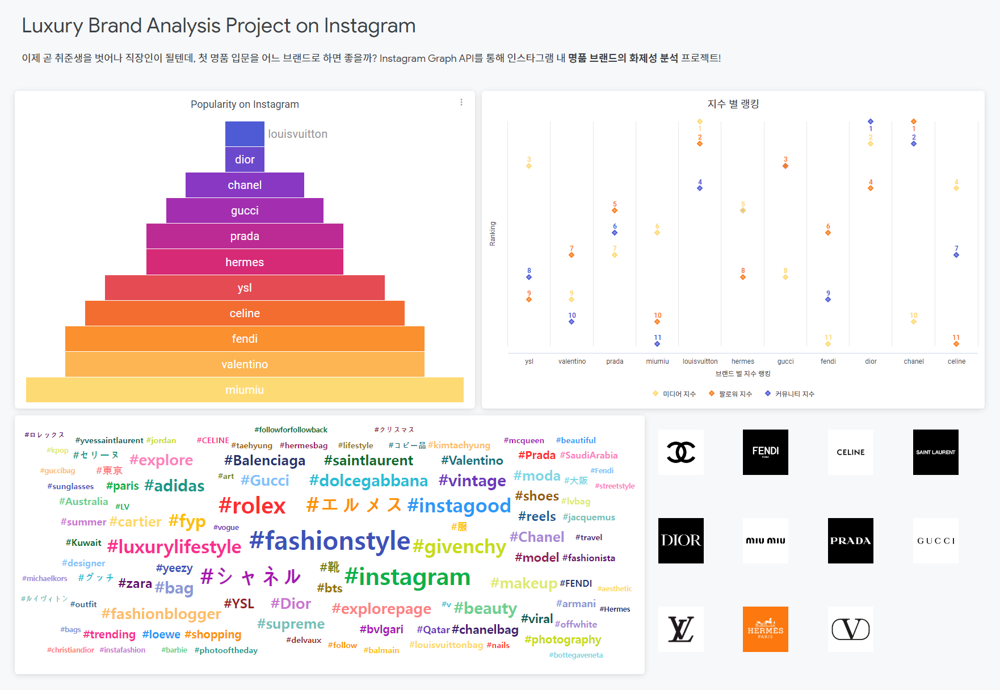
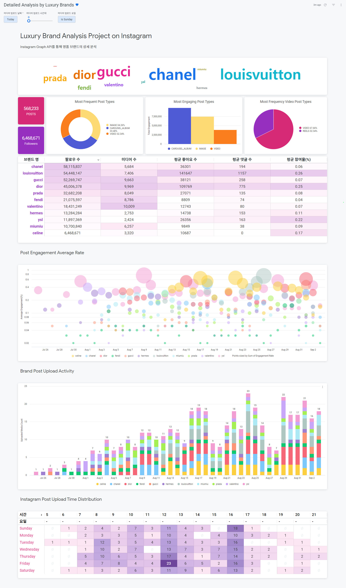
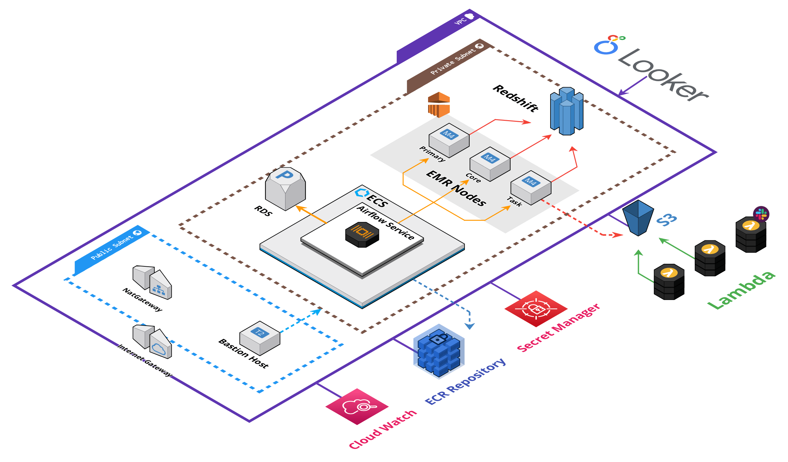
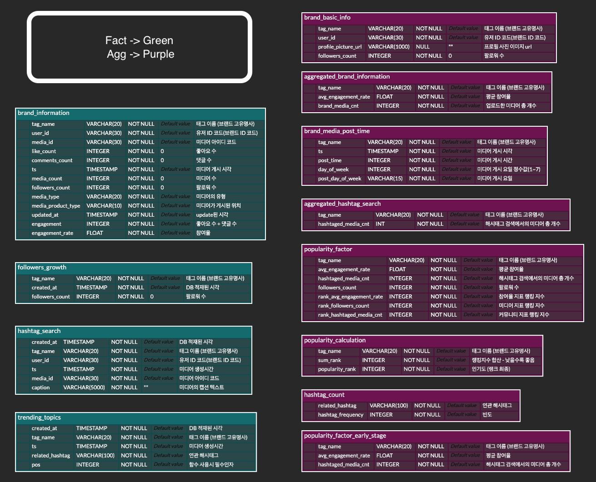

# 명품 브랜드 인스타그램 화제성 분석 프로젝트

인스타그램 API를 통해 데이터 파이프라인을 구축하고, 브랜드의 화제성을 대시보드로 조회한다
 

## 1. Project Outline

명품 브랜드의 인스타그램 계정과 관련 해시태그를 수집하여  
브랜드의 활동성과 인지도를 측정하고, 각 브랜드의 고유한 온라인 마케팅 전략을 파악합니다.  
이를 통해 브랜드 간의 차별화를 확인하고 경쟁 우위를 평가하며, 소비자 동향을 파악할 수 있습니다.

### Project Duration

2023.08.07 ~ 2023.09.02 (약 3주)

### Team Members & Roles

| Field \ Name | **이성희 [@gracia10](https://github.com/gracia10)** | **이하윤[@ha6oon](https://github.com/ha6oon)** | **임형우[@Hyuoo](https://github.com/Hyuoo)** |
|:--:|:---:|:---:|:---:|
|**Planning**|데이터 모델링 |데이터 모델링, KPI 정의 |데이터 모델링|
|**Infra**| AWS 네트워크 관리, AWS 데이터/컨테이너 환경 구축,  Airflow CI/CD | - |AWS Lambda 관리,   스크래퍼 CI/CD|
|**Scrapping**| - | - |Instagram API 스크래퍼, Lambda Event 스케줄링|
|**ETL**|Airflow ETL Dag 개발, EMR 프로세스 개발, Slack 모듈 개발| - | - |
|**ELT**|-|데이터 마트 모델링, 마트 쿼리 작성, Airflow ELT Dag 개발, EMR 프로세스 개발 | 데이터 마트 모델링, 마트 쿼리 작성|
|**Visualization**|-| Looker 대시보드 생성| Looker 대시보드 생성|
 

## 2. Result (Looker Dashboard)

<!-- <video src="./files/BI_Video.mp4"> -->

## 3. Tech Stack

| Field | Stack |
|:---:|:---|
| Infra |  <I1gpngc="https://img.shields.io/badge/AWS Secrets Manager-DF0101?style=flat&logo=Amazon+AWS&logoColor=white"/>  |
|Scrapping| |
| ETL & ELT |    |
| Data Storage |    
| BI tool |  |
| CI/CD |     |
| ETC| |

## 4. Architecture

## 5. ERD
__1. RAW_DATA Schema__
  

__2. Analytics Schema__ 

## 6. Modules
| Name | Explanation |
|:---:|:---|
| [LuxuryBrands_Infra]("https://github.com/LuxuryBrands/LuxuryBrands_Infra") | 프로젝트 환경설정과 관련된 모듈 |
| [LuxuryBrands_DataCollector]("https://github.com/LuxuryBrands/LuxuryBrands_DataCollector") | API Scrapper 모듈 |
| [LuxuryBrands_Airflow]("https://github.com/LuxuryBrands/LuxuryBrands_Airflow") | ETL/ELT 파이프라인 모듈 |
| [LuxuryBrands_Looker]("https://github.com/LuxuryBrands/LuxuryBrands_Looker") | 시각화 설정 모듈 |

## 7. Documnet
프로젝트의 자세한 정보는 아래 문서를 참고하여 주시길 바랍니다
- [프로젝트_보고서.pdf](files/project_report.pdf)